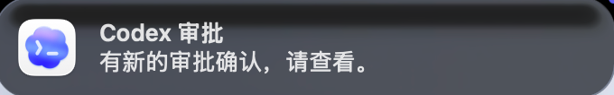

# Codex Approval Notifier

macOS-only helper that shows a system notification when Codex opens a real command-approval prompt.

For macOS only.

中文快速入口：

- [中文说明](#中文说明)
- [中文安装](#中文安装)
- [中文排错](#中文排错)

## Overview

Codex Approval Notifier is a small macOS companion for Codex CLI.

It watches Codex session data, detects real approval prompts, and sends a native macOS notification through a local helper app.

This project is intended for:

- Codex users on macOS
- People who want a real notification only when approval is actually requested
- Local installation on a personal machine

This project is not intended for:

- Windows
- Linux
- notarized enterprise deployment
- general-purpose cross-platform notification workflows

## Community

Thanks to the [Linux.do](https://linux.do/) community for the attention, discussion, and practical feedback around projects like this one.

That kind of early recognition and real-world usage feedback helps small utility tools get refined faster.

## What it does

- Watches Codex session files under `~/.codex/sessions`
- Detects real approval requests such as `exec_command` calls with `sandbox_permissions=require_escalated`
- Queues a notification
- Uses a small macOS app in `/Applications/CodexApprovalNotifier.app` to deliver the notification

Notification text:

`有新的审批确认，请查看。`

Example notification:



## Requirements

- macOS only
- Codex CLI already installed and in use
- `python3`
- `swiftc`
- Permission to copy an app into `/Applications`

## Install

From this repository root:

```bash
chmod +x install.sh
./install.sh
```

The installer will:

1. Copy the watcher/notifier sources into `~/.codex/scripts`
2. Build `CodexApprovalNotifier.app`
3. Install the app into `/Applications`
4. Register two LaunchAgents:
   - `com.coder.codex-approval-notifier`
   - `com.coder.codex-approval-watcher`
5. Open the app so you can approve notification permissions

## First-run setup

After install:

1. Open `CodexApprovalNotifier.app` if it is not already open
2. Go to `System Settings -> Notifications`
3. Allow notifications for `CodexApprovalNotifier`

## Verify

You can trigger a test notification by running:

```bash
python3 - <<'PY'
import importlib.util
spec = importlib.util.spec_from_file_location('watcher', '/Users/coder/.codex/scripts/codex_approval_watcher.py')
mod = importlib.util.module_from_spec(spec)
spec.loader.exec_module(mod)
mod.send_notification('Codex Test', '这是测试通知')
print('queued')
PY
```

## Uninstall

```bash
chmod +x uninstall.sh
./uninstall.sh
```

## Files installed on the target machine

- `/Applications/CodexApprovalNotifier.app`
- `~/.codex/scripts/codex_approval_watcher.py`
- `~/.codex/scripts/codex_approval_notifier_main.swift`
- `~/Library/LaunchAgents/com.coder.codex-approval-watcher.plist`
- `~/Library/LaunchAgents/com.coder.codex-approval-notifier.plist`

## Logs

- `~/.codex/approval-watcher.log`
- `~/.codex/app-notifier.log`

## Notes

- The installer tries to reuse the Codex app icon from `/Applications/Codex.app` if it exists.
- This project is currently packaged for local installation, not notarized distribution.

## Repository layout

- `scripts/codex_approval_watcher.py`
  Watches Codex session files and writes notification tasks into a local queue.
- `scripts/codex_approval_notifier_main.swift`
  macOS notifier app entry point. It consumes queued notification tasks and sends native notifications.
- `install.sh`
  Installs the app, scripts, and LaunchAgents.
- `uninstall.sh`
  Removes the installed app, scripts, LaunchAgents, and local logs/queue.
- `app-template/Contents/Info.plist`
  Base app metadata used to build the helper app.
- `launchagents/`
  Reference LaunchAgent plist files.

## How it works

1. Codex creates a real approval request.
2. The watcher detects that request from `~/.codex/sessions`.
3. The watcher writes a notification job into `~/.codex/notification-queue`.
4. The background notifier app consumes the queue and shows a native macOS notification.

This means the notification is triggered by a real approval event, not by pre-guessing whether a command might need approval.

## Troubleshooting

- If notifications do not appear:
  - Open `/Applications/CodexApprovalNotifier.app` once manually.
  - Check `System Settings -> Notifications -> CodexApprovalNotifier`.
  - Verify both LaunchAgents are loaded.
- If approval events are not detected:
  - Check `~/.codex/approval-watcher.log`.
- If the app starts but notifications still fail:
  - Check `~/.codex/app-notifier.log`.

## Chinese

## 中文说明

`Codex Approval Notifier` 是一个仅支持 macOS 的 Codex 审批提醒工具。

它的作用是：

- 监听 Codex 的真实审批事件
- 只在真正出现审批确认时发出系统通知
- 不对普通命令做“可能需要审批”的预判提醒

适用范围：

- 仅支持 macOS
- 适合本机本地安装使用
- 依赖本机已安装并使用 Codex CLI

### 社区反馈

感谢 [Linux.do](https://linux.do/) 社区的关注、讨论和使用反馈。

这类面向真实场景的小工具，能够更快被打磨出来，也离不开社区用户的认可、试用与建议。

不适用范围：

- 不支持 Windows
- 不支持 Linux
- 目前不是经过 notarize 的正式发行版
- 不适合作为跨平台通用通知方案

### 功能说明

- 监听 `~/.codex/sessions` 中的真实审批事件
- 识别 `sandbox_permissions=require_escalated` 这类真实审批请求
- 将通知任务写入本地队列
- 由 `/Applications/CodexApprovalNotifier.app` 读取队列并发送 macOS 系统通知

通知文案：

`有新的审批确认，请查看。`

### 工作原理

1. Codex 在会话中产生真实审批请求
2. watcher 脚本监听 `~/.codex/sessions`
3. watcher 把通知任务写入 `~/.codex/notification-queue`
4. 后台常驻的 `CodexApprovalNotifier.app` 消费队列并发送 macOS 原生通知

所以它的特点是：

- 通知时机更准
- 只在真实审批出现后提醒
- 不会因为普通命令大量误报

## 中文安装

在仓库根目录执行：

```bash
chmod +x install.sh
./install.sh
```

安装完成后会：

1. 复制脚本到 `~/.codex/scripts`
2. 构建并安装 `/Applications/CodexApprovalNotifier.app`
3. 注册两个 LaunchAgent
4. 打开 app，方便你授予通知权限

### 首次使用

安装后建议手动检查：

1. 打开 `/Applications/CodexApprovalNotifier.app`
2. 打开 `系统设置 -> 通知`
3. 确认 `CodexApprovalNotifier` 已允许通知

### 验证

你可以手动触发一条测试通知：

```bash
python3 - <<'PY'
import importlib.util
spec = importlib.util.spec_from_file_location('watcher', '/Users/coder/.codex/scripts/codex_approval_watcher.py')
mod = importlib.util.module_from_spec(spec)
spec.loader.exec_module(mod)
mod.send_notification('Codex Test', '这是测试通知')
print('queued')
PY
```

### 卸载

```bash
chmod +x uninstall.sh
./uninstall.sh
```

### 日志位置

- `~/.codex/approval-watcher.log`
- `~/.codex/app-notifier.log`

### 安装后写入的文件

- `/Applications/CodexApprovalNotifier.app`
- `~/.codex/scripts/codex_approval_watcher.py`
- `~/.codex/scripts/codex_approval_notifier_main.swift`
- `~/Library/LaunchAgents/com.coder.codex-approval-watcher.plist`
- `~/Library/LaunchAgents/com.coder.codex-approval-notifier.plist`

### 仓库结构

- `scripts/codex_approval_watcher.py`
  监听 Codex 审批事件并写入通知队列
- `scripts/codex_approval_notifier_main.swift`
  通知 app 的入口，负责消费队列并发送 macOS 通知
- `install.sh`
  安装脚本
- `uninstall.sh`
  卸载脚本
- `app-template/Contents/Info.plist`
  app 元数据模板
- `launchagents/`
  LaunchAgent 参考配置

## 中文排错

- 如果没有通知：
  - 手动打开一次 `/Applications/CodexApprovalNotifier.app`
  - 检查 `系统设置 -> 通知 -> CodexApprovalNotifier`
  - 确认两个 LaunchAgent 处于运行状态
- 如果没有捕获到审批：
  - 查看 `~/.codex/approval-watcher.log`
- 如果 app 已启动但通知异常：
  - 查看 `~/.codex/app-notifier.log`

### 说明

- 这是一个 for macOS 的工具，不支持其它系统
- 默认通知文案为：`有新的审批确认，请查看。`
- 目前是本地安装分发方案，不是 notarize 后的正式发行包

### 通知效果示例


